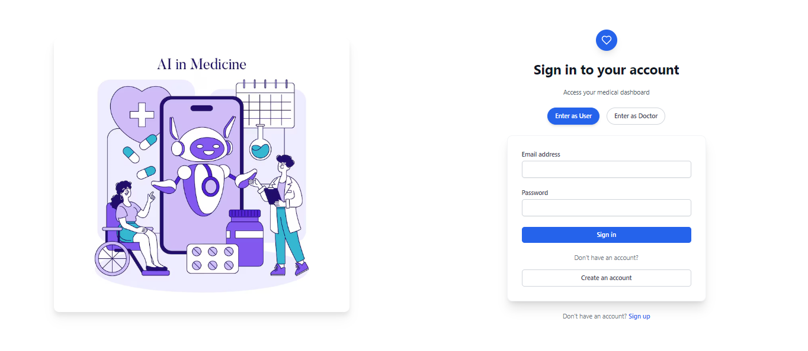
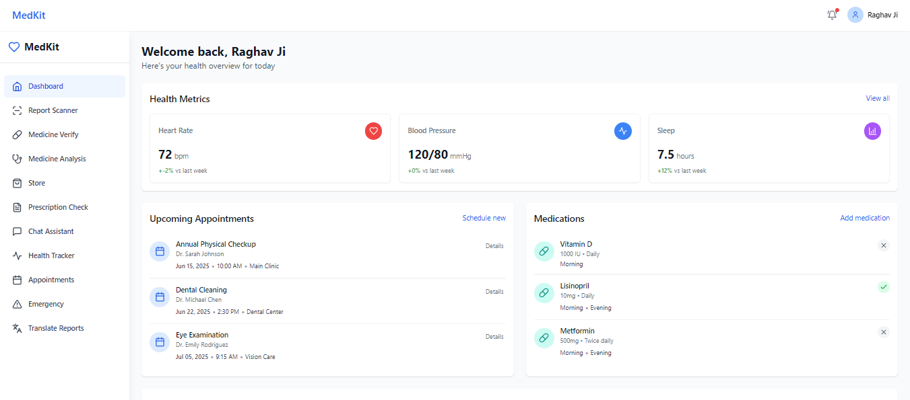
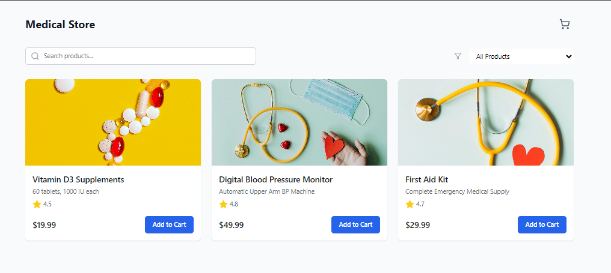
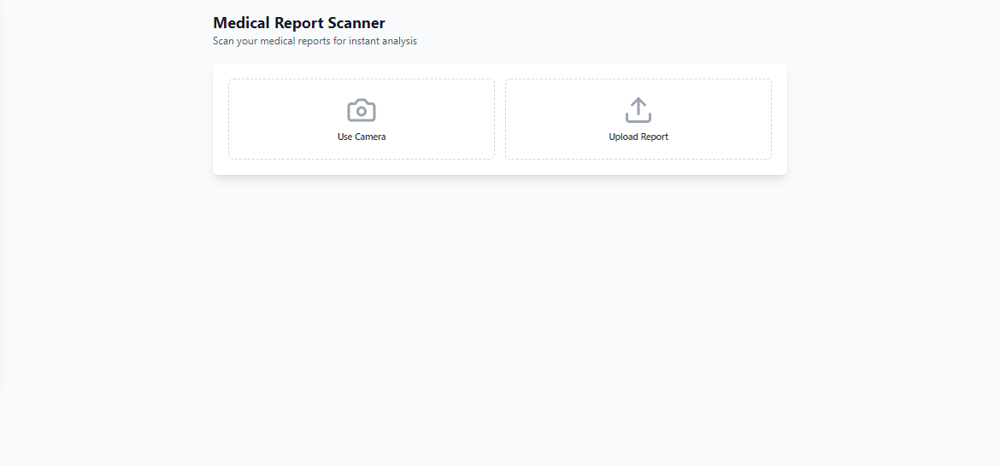
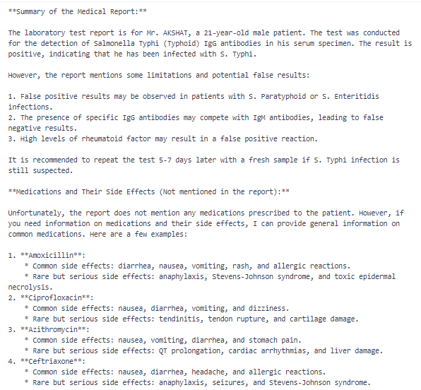
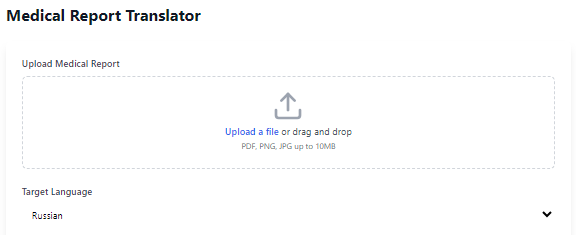
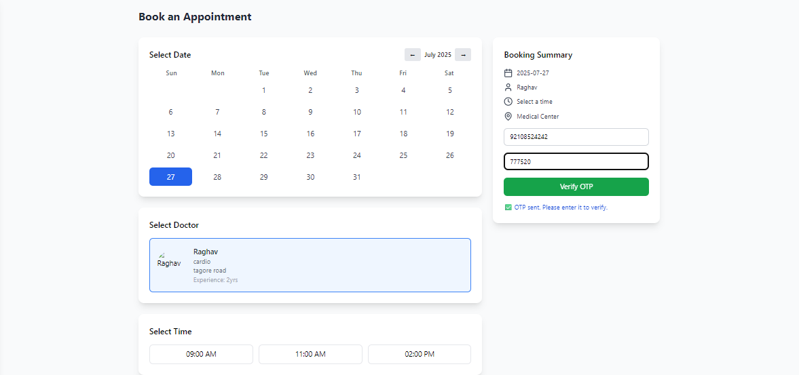

# 🩺 MedKit – AI-Powered Medical Assistant WebApp

**MedKit** is a full-stack web application that leverages AI to simplify healthcare communication and accessibility. It provides medical report summarization, multi-language translation, and appointment scheduling—all in one intuitive platform.

---

## 🚀 Key Features

- 📝 **Medical Report Summarization**: Upload documents and receive concise summaries using Cerebras NLP models.
- 🌐 **Multi-Language Support**: Translates reports into **14+ languages** for better accessibility and understanding.
- 📅 **Doctor Appointment Scheduling**: Seamlessly book medical consultations through a guided UI.
- ⚙️ **Real-Time Processing**: NLP-powered pipeline reduces manual interpretation time by **70%**.
- 🌍 Designed to improve healthcare access for users across different languages and regions.

---

## 🛠️ Tech Stack

| Layer        | Tools/Frameworks                          |
|--------------|--------------------------------------------|
| **Frontend** | React, Tailwind CSS, React Hook Form, i18next |
| **Backend**  | Node.js, Express.js, RESTful APIs         |
| **AI/NLP**   | Cerebras NLP (LLM), LangChain (optional)  |
| **Translation** | Google Translate API / LibreTranslate     |
| **Database** | MongoDB (for appointment & user data)     |

---

## 📷 Screenshots

> Add your UI and feature screenshots in the `assets/` folder and update the paths.

### 🔹 Login and signup page



### 🔹 Dashboard and landing page



### 🔹 E-commerce and store




### 🔹 Medical Report Upload and Summary




### 🔹 Language Translation View



### 🔹 Appointment Scheduler



---

## 🧾 Setup Instructions

1. **Clone the repository**:
   ```bash
   git clone https://github.com/your-username/medkit.git
   cd medkit
   
2. **Set up the backend**:
    ```bash
   cd server
   npm install
   npm run dev

3. **Set up the frontend**:
    ```bash
    cd ../frontend4
    npm install
    npm start

4. Add .env files to both frontend/ and server/ directories with appropriate API keys.
5. Environment Variables
```bash
PORT=5000
CEREBRAS_API_KEY=your_cerebras_api_key
MONGODB_URI=your_mongo_uri
TRANSLATE_API_KEY=your_translation_api_key

```
## 📌 Future Enhancements
🗣️ Voice-to-text input for report uploads

🧠 Integration with Electronic Health Records (EHRs)

📊 Dashboard for doctors with patient summary history

